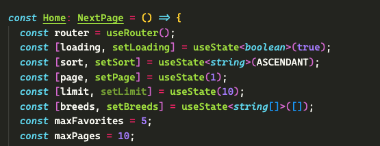

# Fetch Rewards | Frontend

## Dog match adoption webapp

This is a webapp built in Nextjs with tailwind, made to help people to find their life partners 🦴

### How to get started

1. Clone the repository

```bash
git clone git@github.com:Hai5edfm/Fetch-Rewards-Frontend.git
```

2. Enter to the folder

```bash
cd Fetch-Rewards-Frontend
```

3. Install the dependencies

```bash
    npm install
```

4. Copy the .env.example variables to a .env file

5. Run the project in a local server:

```bash
npm run dev
```

### Additional configs

In Home page you can change the default configs for limit of results in a single page `(limit)` and max pages for the navigation `(maxPages)`, as well as the number of `(maxFavorites)` that the user must select for finding their match (api accepts max 100)


